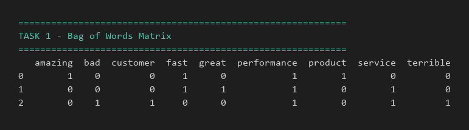
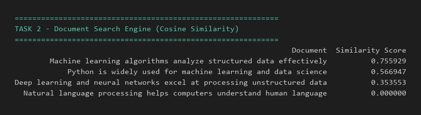

# Lab 04 – Bag of Words & Cosine Similarity

This lab explores two core NLP concepts:

- **Bag of Words (BoW):** Converting text into numerical vectors by counting word occurrences (ignoring order).
- **Cosine Similarity:** Measuring how similar two documents are by computing the cosine of the angle between their BoW vectors.

## Tasks

### Task 1 – Bag of Words Matrix
Builds a BoW matrix from a small product-review corpus using `CountVectorizer` with English stop-word removal, and displays it as a Pandas DataFrame.

### Task 2 – Document Search Engine
Ranks a set of documents against a user query using cosine similarity on their BoW vectors.

---

## Output Screenshots

### Task 1 Output
<!-- Paste your Task 1 screenshot below -->


### Task 2 Output
<!-- Paste your Task 2 screenshot below -->


---

## Viva Questions & Answers

### Q1: Word Order Invariance
**Q:** How does BoW handle word order, and why is that a limitation?

**A:** "Dog bites man" and "Man bites dog" produce the identical BoW vector because BoW only counts word occurrences, not order or position. Both sentences have the same 3 words appearing once each, so the vector is identical despite opposite meanings. This is a serious limitation for sentiment analysis since meaning and sentiment often depend on word order and which word modifies which.

---

### Q2: Sparsity Issue
**Q:** What happens with a large vocabulary?

**A:** With a 100,000-word vocabulary, each document vector has 100,000 dimensions, but any single document only uses a tiny fraction of those words. This makes the matrix extremely sparse (mostly zeros), so dense storage wastes huge memory - which is why libraries like scikit-learn use sparse matrix formats, storing only non-zero entries and keeping density near 0%.

---

### Q3: Zero Similarity
**Q:** Why does Document 3 score 0.0000 against the query?

**A:** Document 3 scores 0.0000 against the query "machine learning algorithms for data" because after stop word removal, none of its meaningful terms (language, processing, computers, understand, human) overlap with any query term (machine, learning, algorithms, data). Since the dot product of two vectors with no shared non-zero positions is 0, and cosine similarity's numerator is that dot product, the result is 0 - meaning the vectors are orthogonal.

---

## How to Run

```bash
pip install numpy pandas scikit-learn
python solution.py
```
